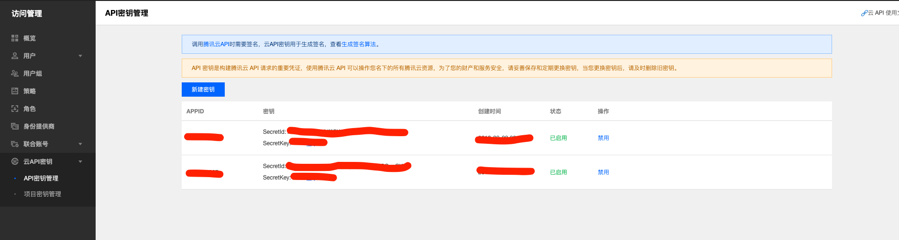

# SmartPic 简介和帮助

SmartPic 是一款 Alfred workflow，可以方便大家上传图片到云上，并获取图片链接，可用于 Markdown 写文章时添加图片或其他用途。

> 注：SmartPic 基于 Python 2.7，请确保已安装 Python。

## 安装

下载 SmartPic.alfredworkflow 文件后，双击即可。当然，前提是已安装 Alfred（请自行安装）。

## 配置

SmartPic 其实是将图片上传至腾讯云存储桶，所以你需要自行申请免费的存储桶，并将存储桶相关参数配置到本地即可。

1. 登录腾讯云创建存储桶 [点击创建](https://console.cloud.tencent.com/cos5/bucket)。点击会打开腾讯云，界面如下图，点击其中的```创建存储桶```进行创建。


2. 创建完成后的界面如下图：


3. 点击左侧的[密钥管理](https://console.qcloud.com/cam/capi)，可以找到配置参数中的 secret_id、secret_key、以及 APPID


4. 点击[存储桶列表](https://console.qcloud.com/cos/bucket)，进入要使用的存储桶，在基础配置选项卡中找到"空间名称"，bucket 参数格式为 `空间名称-APPID`，例如 `example-125226*****`

5. 查看所属地区，例如 `北京（bj）`，在[文档中心---地域和访问域名](https://cloud.tencent.com/document/product/436/6224)中查看对应的 region 值，北京对应的是 `ap-beijing`

6. 在存储桶---域名管理中，可以看到**默认访问域名**，有适用于 `JSON API` 和 `XML API` 两个，这里使用**适用于 XML API** 的域名，才可以正确预览图片。例如 `example-125226*****.cos.ap-beijing.myqcloud.com`，对应 blog_prefix

7. 呼出 Alfred，输入 SmartPic 命令，按下 Enter 进入菜单界面，并选择 ```config``` 菜单（如下图），在打开的文件中以 json 方式配置上述步骤中找到的 secret_id、secret_key、bucket、region、blog_prefix 五项参数，替换指定部分即可，以下述代码为例。

    ```config.txt```文件的配置格式

    ```json
    {
        "secret_id": "${your_secret_id}",
        "secret_key": "${your_secret_key}",
        "region": "ap-guangzhou",
        "bucket": "${your_bucket_name-APPID}",
        "blog_prefix": "${your_default_domain}"
    }
    ```

8. 具体配置参考 [Python SDK 使用文档](https://cloud.tencent.com/document/product/436/12269)
## 使用

### SmartPic 命令

此命令包含以下四个命令：

- ```config```：配置存储桶参数
- ```list```：查看已上传图片列表，移动到指定项：Cmd + Y 可查看图片；Enter 可复制图片链接
- ```uploadPic```：上传图片：搜索出图片，Enter 后即可上传，上传完成会自动复制链接到剪切板
- ```help```：查看帮助文档

### SmartPicUploadPic 命令

上传图片：搜索出图片，Enter 后即可上传，上传完成会自动复制链接到剪切板。
